# Full Development Workflow: From Requirement to Release

```mermaid
flowchart TD
    START([User Request]) --> RC

    %% ──────────────── Requirement Phase ────────────────
    subgraph REQ["Phase: Requirement Clarification"]
        RC["/requirement-clarification<br/>Structured Q&A (Max 6 questions)"]
        RC --> SPEC["Output Requirement Spec"]
        SPEC --> GATE_SPEC{{"🔴 Human Gate<br/>Confirm Spec"}}
    end

    GATE_SPEC -->|Confirm| CHOOSE
    GATE_SPEC -->|Issue| RC

    %% ──────────────── Path Selection ────────────────
    CHOOSE{{"Select Dev Mode"}}
    CHOOSE -->|"Clear reqs, full AI execution"| AUTODEV
    CHOOSE -->|"Iterative, human driven"| DEVFLOW

    %% ──────────────── AUTO-DEV ────────────────
    subgraph AUTODEV["auto-dev (AI-driven Mode)"]
        direction TB

        subgraph P0["Phase 0: Guideline Pre-load"]
            A0_1["Read project.config.json"]
            A0_2["Read conventions.md Quick Ref"]
            A0_3["Lazy-load skills<br/>(frontend/db guide)"]
            A0_4["Pre-read decisions index"]
            A0_5["Generate Guideline Snapshot (≤30 lines)"]
            A0_1 --> A0_2 --> A0_3 --> A0_4 --> A0_5
        end

        subgraph P1["Phase 1: Project Setup"]
            A1_1["Checkout feature/ branch"]
            A1_2["Generate Task Checklist<br/>P0/P1/P2 levels"]
            A1_1 --> A1_2
        end

        subgraph P2["Phase 2: Solution Design"]
            A2_CHECK{"Lightweight Task?<br/>(≤2 files bug fix / style only)"}
            A2_CHECK -->|No| A2_PR["/proposal-review<br/>Generate Proposal"]
            A2_CHECK -->|Yes| A2_SIMPLE["Output simplified technical plan"]
            A2_PR --> A2_TECH["Append technical details<br/>Component reuse + Decision draft"]
            A2_SIMPLE --> GATE_PLAN
            A2_TECH --> GATE_PLAN{{"🔴 Human Gate<br/>Confirm Proposal"}}
        end

        subgraph P3["Phase 3: Code Execution (Ralph-loop)"]
            direction TB
            HANDOFF_CHECK{"Spec handoff?<br/>(large or delegated task)"}
            HANDOFF_CHECK -->|Yes| WRITE_SPEC["Write spec-*<br/>to agent.signal_dir"]
            WRITE_SPEC --> RUN_SPECS["/run-pending-specs<br/>verify-spec + session"]
            HANDOFF_CHECK -->|No| FS_CHECK
            FS_CHECK{"Full-stack task?"}
            FS_CHECK -->|Yes| FE_FIRST["Round 1: Frontend Component-TDD"]
            FS_CHECK -->|No| RALPH

            subgraph FE_TDD["Frontend-First"]
                FE_FIRST --> FE_TEST["Write behavior test → Lock baseline"]
                FE_TEST --> FE_IMPL["Implement component"]
                FE_IMPL --> FE_UX["/frontend-ux-evaluator"]
                FE_UX --> GATE_FE{{"🔴 Human Gate<br/>Confirm UX"}}
                GATE_FE -->|"🔴 Must fix"| FE_IMPL
                GATE_FE -->|Pass| FE_NEXT{"More components?"}
                FE_NEXT -->|Yes| FE_TEST
                FE_NEXT -->|No| BE_START["Round 2: Backend<br/>Derive API contract from UI"]
            end

            BE_START --> RALPH

            subgraph LOOP["Ralph-loop Self-cycle"]
                RALPH["Assess: Pick P0/P1 issue"]
                RALPH --> ACT["Act: Execute changes<br/>Auto-mount domain guardrails"]
                ACT --> VERIFY["Verify: 3-layer check<br/>①Goal ②Scope ③New issues"]
                VERIFY --> LOG["Log: Record & Persist<br/>tmp/.agent-session.md"]
                LOG --> EXIT_CHECK{"All P0 resolved?<br/>No new P0?"}
                EXIT_CHECK -->|No| RALPH
            end
        end

        subgraph P4["Phase 4: Human Verification"]
            A4_REPORT["Output verify report<br/>Assets changed / Compliance / Leftovers"]
            A4_REPORT --> GATE_VERIFY{{"🔴 Human Gate<br/>Confirm Changes"}}
        end

        subgraph P5["Phase 5: Compliance Convergence"]
            A5_COMMIT["/commit-with-affects<br/>Standard commit with blast radius"]
            A5_DECISION{"Unrecorded decisions?"}
            A5_COMMIT --> A5_DECISION
            A5_DECISION -->|Yes| A5_ADR["/record-decision"]
            A5_DECISION -->|No| A5_CLEAN["Delete session state"]
            A5_ADR --> A5_CLEAN
        end

        P0 --> P1 --> P2
        GATE_PLAN -->|Confirm| HANDOFF_CHECK
        GATE_PLAN -->|Issue| A2_PR
        RUN_SPECS --> A4_REPORT
        EXIT_CHECK -->|Yes| P4
        GATE_VERIFY -->|Confirm| P5
        GATE_VERIFY -->|Issue| RALPH
    end

    %% ──────────────── DEV-FLOW ────────────────
    subgraph DEVFLOW["dev-flow (Human-driven Mode)"]
        direction TB
        D1["Step 1: Probe & Research<br/>(If: new route / huge refactor)"]
        D2["Step 2: Read Mental Guardrails<br/>Load conventions + domain skill"]
        D3_CHECK{"Lightweight Task?"}
        D3["Step 3: /proposal-review<br/>Proposal Review"]
        D3_GATE{{"🔴 Human Gate<br/>Confirm Proposal"}}
        D4["Step 4: /impact-analysis<br/>(If: API/DB/Cross-components)"]
        D5["Step 5: Test Skeleton<br/>(Routed by change type)"]
        D55{"Step 5.5:<br/>Spec handoff?"}
        D55_SPEC["Write spec → /run-pending-specs<br/>verify-spec + session"]
        D6["Step 6: Code Development"]
        D7["Step 7: DB Audit<br/>(If: ORM changed)"]
        D8["Step 8: Test Gate<br/>run-tests --mode fast"]
        D9["Step 9: /commit-with-affects"]

        D1 --> D2 --> D3_CHECK
        D3_CHECK -->|No| D3 --> D3_GATE
        D3_CHECK -->|Yes| D4
        D3_GATE -->|Confirm| D4
        D3_GATE -->|Issue| D3
        D4 --> D5 --> D55
        D55 -->|Yes| D55_SPEC --> D8
        D55 -->|No| D6 --> D7 --> D8
        D8 -->|"❌ FAIL"| D6
        D8 -->|"✅ PASS"| D9
    end

    %% ──────────────── PR & RELEASE ────────────────
    subgraph RELEASE["Phase: PR & Release"]
        PR["/pr-review<br/>PR Description + 4D Self-check"]
        PROD["/production-release<br/>Hygiene Scan → Test → DDL Review → Deploy"]
        GATE_PROD{{"🔴 Human Gate<br/>Release Confirm"}}
        PR --> PROD --> GATE_PROD
    end

    A5_CLEAN --> PR
    D9 --> PR
    GATE_PROD -->|Confirm| DONE([Release Completed])
    DONE --> DREAM["/dream<br/>Memory consolidation"]
    DREAM --> PWI["/propose-workflow-improvements<br/>(optional Escrow proposals)"]

    %% ──────────────── STYLES ────────────────
    classDef gate fill:#ff6b6b,stroke:#c0392b,color:#fff,font-weight:bold
    classDef skill fill:#4ecdc4,stroke:#1a535c,color:#fff
    classDef phase fill:#f7f1e3,stroke:#aaa

    class GATE_SPEC,GATE_PLAN,GATE_FE,GATE_VERIFY,GATE_PROD,D3_GATE gate
    class RC,A2_PR,FE_UX,A5_COMMIT,A5_ADR,PR,PROD,D3,D4,D8,D9,WRITE_SPEC,CODEX,RUN_SPECS,D55_SPEC,DREAM,PWI skill
```

## Human Gates Summary

| Gate | Location | Trigger Condition | Pass Condition |
|------|------|----------|----------|
| Requirement Confirmation | After requirement-clarification | Always | User confirms the spec |
| Proposal Review | auto-dev Phase 2 / dev-flow Step 3 | Non-lightweight task | User replies "Confirm, proceed" |
| UX Evaluation | After each frontend-tdd component | Involves Frontend UX | User confirms all 🔴 fixed |
| Change Verification | auto-dev Phase 4 | Always | User confirms verification report |
| Release Confirmation | production-release | Always | QA + DBA + Deploy Approval |

## Lightweight Path (Skip proposal-review)

The following scenarios automatically skip the proposal review gate to reduce confirmation fatigue:
- Bug fix with expected modified files ≤ 2
- Style / copy text tweaks only
- Single-file local modification
