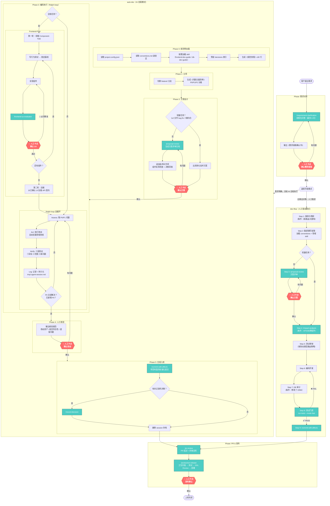

# 完整开发流程图：从需求到上线

## 人工卡点汇总

| 卡点 | 位置 | 触发条件 | 通过条件 |
|------|------|----------|----------|
| 需求确认 | requirement-clarification 输出后 | 始终 | 用户确认规格书 |
| 方案评审 | auto-dev Phase 2 / dev-flow Step 3 | 非轻量任务 | 用户回复"确认，继续执行" |
| UX 评估 | frontend-tdd 每个组件完成后 | 涉及前端 UX | 用户确认所有 🔴 已修复 |
| 改动核验 | auto-dev Phase 4 | 始终 | 用户确认核验报告 |
| 发布确认 | production-release | 始终 | QA + DBA + 部署审批 |

## 轻量路径（跳过 proposal-review）

以下场景自动跳过方案评审卡点，减少确认疲劳：
- Bug fix 且预计改动文件 ≤ 2 个
- 纯样式 / 纯文案调整
- 单文件局部修改
